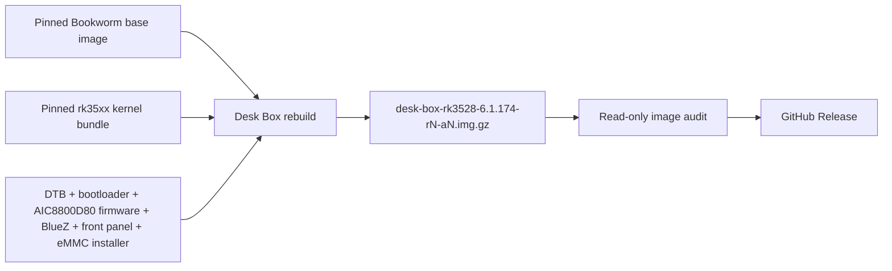

<div align="center">
  

# Xiaozhi Desk Box Armbian

**A focused Bookworm image for one RK3528 Desk Box.**

[](https://github.com/hudrucan/xiaozhi-desk-box/releases/latest)
[](#hardware)
[](#current-scope)
[](LICENSE)

[Download](https://github.com/hudrucan/xiaozhi-desk-box/releases/latest) · [Build](#build) · [Install to eMMC](#install-to-emmc) · [Boot chain](#validated-boot-chain) · [Companion projects](#companion-projects)
</div>

---

This is a single-board fork of
[`ophub/amlogic-s9xxx-armbian`](https://github.com/ophub/amlogic-s9xxx-armbian).
It turns a pinned upstream Armbian server image into a runtime-clean Desk Box
image while keeping the hardware payloads that were verified on the reference
device.

## Highlights

| | |
|---|---|
| 🎯 **One target** | Only the `deskbox` board profile is exposed. |
| 🔒 **Pinned inputs** | Base image, rk35xx kernel bundle, DTB, bootloader, Wi-Fi firmware, regulatory database and BlueZ package are checksum-verified. |
| 🧹 **Focused image** | One DTB, one AIC8800D80 firmware set, no kernel headers, generic startup hooks, package caches or upstream self-update helpers. |
| 🔍 **Release audit** | Every published image is mounted read-only and checked before upload. |
| 🧱 **Known-good boot chain** | Factory-compatible DDR/SPL is paired with the validated RK3528 U-Boot/FIT/ATF payload. |
| 💾 **Guarded eMMC install** | Desk Box-only installer defaults to dry-run, verifies both devices and requires an exact destructive confirmation. |

## Current scope

| Component | Value |
|---|---|
| Board profile | `deskbox` |
| Runtime model | `RK.Deskbox` |
| Distribution | Debian Bookworm, arm64 server |
| Default build kernel | `6.1.174-rk35xx-ophub` |
| Hardware-validated baseline | `6.1.174-rk35xx-ophub` |
| Active DTB | `rockchip/rk3528-deskbox.dtb` |
| Device-tree model | `Rockchip RK3528 Generic TV Box` (retained from known-good baseline) |
| Wi-Fi | AIC8800D80 over SDIO |
| GPU | Mali-450 with the Lima kernel driver; Mesa userspace is not bundled yet |
| Bluetooth | AIC8800D80 H4 over UART2_M0 at 1.5 Mbps; BlueZ 5.66 |
| Front panel | FD6551 HH:MM clock with Wi-Fi, LAN and USB status |
| Timezone / regulatory domain | `Asia/Ho_Chi_Minh` / `VN` |

The project intentionally does not build a kernel or U-Boot. It assembles a
tested image from pinned release artifacts and the board-specific payloads
stored in this repository.

## Hardware

The reference Desk Box uses:

- Rockchip RK3528;
- 4 GB Micron DDR3 and 32 GB eMMC;
- AIC8800D80 SDIO Wi-Fi;
- FD6551-compatible four-digit front panel;
- Ethernet and removable microSD storage.

The functional baseline for this profile was boot-tested from microSD with
Ethernet, SSH, multi-user systemd startup, AIC8800D80 Wi-Fi, the Lima kernel
driver, Bluetooth and the FD6551 front panel operational. The DRM render nodes
and Lima binding were verified; accelerated Mesa/EGL userspace remains a
separate follow-up. Bluetooth HCI Reset, BR/EDR
and LE controller discovery and a BlueZ scan were validated over UART2_M0 at
1.5 Mbps with hardware flow control. The board service discards inherited
build-host rfkill state and explicitly unblocks Bluetooth after
`systemd-rfkill`, so boot does not require a manual `rfkill unblock`. Each newly
published image still requires a hardware boot test. The eMMC installer is
structurally audited during the build, but its destructive path still requires
an explicit on-device test.

## Download and first boot

Download the `desk-box-rk3528-6.1.174-r*-a*.img.gz` asset and its `.sha256`
file from the
[latest release](https://github.com/hudrucan/xiaozhi-desk-box/releases/latest),
verify the checksum, then flash the compressed image with Balena Etcher or an
equivalent raw-image writer.

The debug image intentionally retains `root` / `1234` for bring-up and agent
access. Change the password before connecting the box to an untrusted network.
The legacy `/boot/armbian_first_run.txt` template is not included because the
current Armbian first-login path does not consume it.

## Install to eMMC

> [!WARNING]
> The installer permanently erases every existing filesystem and file on the
> internal `/dev/mmcblk2`. It is only for the supported Desk Box profile. Boot
> and fully test the image from SD before considering eMMC installation.

1. Flash the release image to SD and boot the Desk Box from it.
2. Verify networking, SSH, Wi-Fi, Bluetooth, DRM/Lima binding and the front
   panel from SD.
3. Review the read-only plan:

   ```bash
   sudo deskbox-install-emmc --dry-run
   ```

4. Start installation and type the exact confirmation requested on screen:

   ```bash
   sudo deskbox-install-emmc --install
   ```

5. Let every copy, fsck and read-only verification finish. Do not remove the SD
   during installation.
6. Shut down, disconnect power, remove the SD and cold boot from eMMC.

The installer always targets `/dev/mmcblk2`, preserves the audited factory
IDB/SPL and working U-Boot/FIT from the repository artifact, creates clean BOOT
and root filesystems, and updates UUID references automatically. BOOT is
created with the exact block size, inode size and ext4 feature set of the
known-good SD filesystem so the validated vendor U-Boot sees no filesystem
feature delta. It does not copy seller vendor-storage or runtime state.

If installation fails, the original SD remains the recovery medium. Reinsert
or retain it, boot from SD, inspect the timestamped backup under
`/root/deskbox-emmc-backups/`, rerun `--dry-run`, then retry the install after
fixing the reported cause. The automatic backup covers boot and partition
metadata, not the complete former seller filesystem. See
[`EMMC_INSTALL.md`](build-armbian/armbian-files/different-files/deskbox/EMMC_INSTALL.md)
for the exact sector layout, checks and recovery limits.

## Build

The supported build path is
[`Build Desk Box Image`](https://github.com/hudrucan/xiaozhi-desk-box/actions/workflows/build-deskbox.yml)
on GitHub Actions. Its defaults point to the tested Bookworm base and pinned
rk35xx kernel release; both downloads are rejected if their SHA256 values
differ.

A local rebuild requires GNU/Linux x86_64, root privileges, loop devices and
GNU userland tools:

```bash
sudo ./rebuild -b deskbox -a false -k 6.1.174
```

macOS is suitable for editing and device-tree verification, but not for running
the image rebuild engine directly.

## Image pipeline



The build does not clone generic U-Boot or firmware trees. Repository-pinned
board dependencies must be present, and the workflow audits their hashes both
before and after rebuilding the image.

Each workflow attempt creates a new immutable release named
`desk-box-rk3528-<kernel>-r<run>-a<attempt>`. Existing releases and assets are
never edited or overwritten, so a previously tested image remains available for
fallback. The raw image is given the same compact basename before compression,
so extracting the `.img.gz` does not restore a long upstream `Armbian_...` name.

The image does not ship `armbian-update`, `armbian-sync`, `armbian-software` or
the associated generic software center. Kernel changes must go through this
pipeline so the Desk Box DTB, firmware allowlist and filesystem policy are
reapplied and audited before release.

## Validated boot chain

The microSD baseline was verified on the reference device:

- factory-compatible DDR V1.05 and SPL v1.04 at sector 64;
- U-Boot/FIT/ATF at sector 16384;
- root and boot partitions mounted from microSD;
- Linux `6.1.157-rk35xx-ophub` reached multi-user mode;
- Ethernet, SSH and AIC8800D80 Wi-Fi worked.

The current sanitized U-Boot/FIT was then verified with kernel KASLR enabled
across three microSD reboots. The kernel `_stext` base changed on every boot,
systemd reached `running`, and no units failed.

Kernel `6.1.174` is the current build default. Its release checksum and both
AIC8800 SDIO modules were verified before pinning, and the resulting image has
completed a successful microSD boot test on the reference Desk Box.

The board bootloader keeps the factory-compatible DDR parameters required by
the Micron DDR3 layout. See
[`BOOTLOADER.md`](build-armbian/armbian-files/different-files/deskbox/BOOTLOADER.md)
for provenance, offsets and hashes.

## Device tree and firmware

`rk3528-deskbox.dtb` starts from the exact opaque binary from the working
reference box (SHA256
`a918a217d36ef5325c10aeed4c1de70280b52a272559b8f80c54ada66367a5e2`).
The active binary (SHA256
`eed4f973c4cb7088f52da8909bc4dc0654fd8a3f50c27eb44a6f0f66a2c7629c`)
contains the hardware-verified Lima, UART2_M0, FD655 and USB 3.0 configuration
plus the first warning-cleanup batch tested by cold boot from microSD. UART2
intentionally omits DMA and uses the working PIO path; Bluetooth HCI and
discovery remain functional. The FD655 wiring is GPIO4_A3 for CLK and GPIO4_A2
for DAT. The RK3528 Combo PHY is enabled for the DWC3 SuperSpeed path; a Kingston
DataTraveler enumerated through xHCI at 5 Gbit/s and completed a 1 GiB direct
read at 118 MB/s without resets or I/O errors.

The cleanup removes invalid zero-sized DRM loader reservations, the unusable
OP-TEE and FIQ debugger nodes, supplies the TVE OTP references, selects the
validated VOP line-buffer mode and corrects `wifi_chip_type` to `aic8800d80`.
The internal `model` remains `Rockchip RK3528 Generic TV Box`; Desk Box identity
is supplied by the board profile, DTB filename and runtime metadata. The
canonical decompiled source recompiles byte-for-byte to the active binary. See
[`DTB.md`](build-armbian/armbian-files/different-files/deskbox/DTB.md) for the
exact normalized delta and test status.

The seven-file AIC8800D80 payload is an explicit allowlist. Binary firmware
matches the reference device and pinned upstream hashes; the text configuration
removes two keys rejected by the running driver. The tested regulatory
database/signature are included in initramfs, and the driver starts with
`country_code=VN custregd=0`. See
[`FIRMWARE.md`](build-armbian/armbian-files/different-files/deskbox/FIRMWARE.md).

The image also installs the pinned Debian Bookworm BlueZ package, frees UART2
from the serial console/getty and starts `btattach` only after the AIC8800D80
SDIO functions bind. The service uses the hardware-validated H4 transport at
1.5 Mbps; it does not toggle unverified GPIOs. See
[`PACKAGES.md`](build-armbian/armbian-files/different-files/deskbox/PACKAGES.md).

The hardware-validated front-panel service shows the factory-style `boot`
pattern during early userspace, then `----` until chrony reports a valid NTP
reference before switching to local `HH:MM`,
blinks the colon and reflects Wi-Fi, LAN and external USB state. Time validity
is latched after the first synchronization, so a later network loss does not
blank the clock. Clock/alarm, play and pause remain unused. The service
bit-bangs the seller-proven FD6551 protocol on GPIO4_A2/A3; the DTB records the
same wiring for consistency even though the rk35xx kernel does not bind an
FD655 driver. See
[`PANEL.md`](build-armbian/armbian-files/different-files/deskbox/PANEL.md).

## Repository map

| Path | Purpose |
|---|---|
| `.github/workflows/build-deskbox.yml` | Pinned build, audit and release pipeline |
| `action.yml` | Minimal single-target rebuild action |
| `rebuild` | Shared upstream image transformation engine |
| `build-armbian/armbian-files/different-files/deskbox/` | Desk Box rootfs overrides and bootloader |
| `build-armbian/armbian-files/different-files/deskbox/EMMC_INSTALL.md` | eMMC write layout, safety checks and recovery path |
| `build-armbian/armbian-files/platform-files/rockchip/` | RK3528 boot configuration and pinned known-good DTB |
| `build-armbian/armbian-files/common-files/usr/lib/firmware/aic8800_sdio/` | AIC8800D80 firmware allowlist |
| `build-armbian/armbian-files/common-files/usr/lib/firmware/regulatory.db*` | Tested regulatory database and signature |

The `rebuild` engine retains generic platform mechanics inherited from upstream
because they implement partitioning, rootfs conversion and boot assembly. The
public profile and workflow remain Desk Box-only.

## Companion projects

- [`xiaozhi-desk-robot`](https://github.com/hudrucan/xiaozhi-desk-robot) — robot firmware and UI.
- [`xiaozhi-desk-robot-server`](https://github.com/hudrucan/xiaozhi-desk-robot-server) — companion server stack.

## Notes and limitations

- A successful workflow proves image structure, hashes and filesystem policy;
  final hardware behavior still requires a microSD boot test.
- The image is a focused device target, not a general RK3528 distribution.
- eMMC installation is intentionally interactive and Desk Box-specific; the
  destructive path cannot be validated by GitHub Actions.

## Upstream and license

This fork is derived from
[`ophub/amlogic-s9xxx-armbian`](https://github.com/ophub/amlogic-s9xxx-armbian)
and remains licensed under [GPL-2.0](LICENSE). Board payload provenance and
checksums are documented beside the relevant files.
