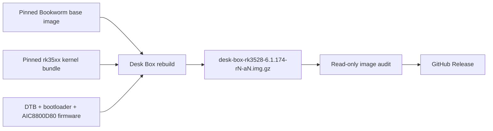

<div align="center">
  

# Xiaozhi Desk Box Armbian

**A focused Bookworm image for one RK3528 Desk Box.**

[](https://github.com/hudrucan/xiaozhi-desk-box/releases/latest)
[](#hardware)
[](#current-scope)
[](LICENSE)

[Download](https://github.com/hudrucan/xiaozhi-desk-box/releases/latest) · [Build](#build) · [Boot chain](#validated-boot-chain) · [Companion projects](#companion-projects)
</div>

---

This is a single-board fork of
[`ophub/amlogic-s9xxx-armbian`](https://github.com/ophub/amlogic-s9xxx-armbian).
It turns a pinned upstream Armbian server image into a runtime-clean Desk Box
image while keeping the hardware payloads that were verified on the reference
device.

## Highlights

| | |
|---|---|
| 🎯 **One target** | Only the `deskbox` board profile is exposed. |
| 🔒 **Pinned inputs** | Base image, rk35xx kernel bundle, DTB, bootloader and Wi-Fi firmware are checksum-verified. |
| 🧹 **Focused image** | One DTB, one AIC8800D80 firmware set, no kernel headers, generic startup hooks, package caches or upstream self-update helpers. |
| 🔍 **Release audit** | Every published image is mounted read-only and checked before upload. |
| 🧱 **Known-good boot chain** | Factory-compatible DDR/SPL is paired with the validated RK3528 U-Boot/FIT/ATF payload. |

## Current scope

| Component | Value |
|---|---|
| Board profile | `deskbox` |
| Runtime model | `RK.Deskbox` |
| Distribution | Debian Bookworm, arm64 server |
| Default build kernel | `6.1.174-rk35xx-ophub` |
| Hardware-validated baseline | `6.1.157-rk35xx-ophub` |
| Active DTB | `rockchip/rk3528-deskbox.dtb` |
| Device-tree model | `Rockchip RK3528 Desk Box` |
| Wi-Fi | AIC8800D80 over SDIO |
| Timezone / regulatory domain | `Asia/Ho_Chi_Minh` / `VN` |

The project intentionally does not build a kernel or U-Boot. It assembles a
tested image from pinned release artifacts and the board-specific payloads
stored in this repository.

## Hardware

The reference Desk Box uses:

- Rockchip RK3528;
- 4 GB Micron DDR3 and 32 GB eMMC;
- AIC8800D80 SDIO Wi-Fi;
- Ethernet and removable microSD storage.

The functional baseline for this profile was boot-tested from microSD with
Ethernet, SSH, multi-user systemd startup and AIC8800D80 Wi-Fi operational.
Each newly published image still requires a hardware boot test. Installing to
eMMC is outside this repository's automated test scope.

## Download and first boot

Download the `desk-box-rk3528-6.1.174-r*-a*.img.gz` asset and its `.sha256`
file from the
[latest release](https://github.com/hudrucan/xiaozhi-desk-box/releases/latest),
verify the checksum, then flash the compressed image with Balena Etcher or an
equivalent raw-image writer.

The debug image intentionally retains `root` / `1234` for bring-up and agent
access. Change the password before connecting the box to an untrusted network.
The legacy `/boot/armbian_first_run.txt` template is not included because the
current Armbian first-login path does not consume it.

## Build

The supported build path is
[`Build Desk Box Image`](https://github.com/hudrucan/xiaozhi-desk-box/actions/workflows/build-deskbox.yml)
on GitHub Actions. Its defaults point to the tested Bookworm base and pinned
rk35xx kernel release; both downloads are rejected if their SHA256 values
differ.

A local rebuild requires GNU/Linux x86_64, root privileges, loop devices and
GNU userland tools:

```bash
sudo ./rebuild -b deskbox -a false -k 6.1.174
```

macOS is suitable for editing and device-tree verification, but not for running
the image rebuild engine directly.

## Image pipeline



The build does not clone generic U-Boot or firmware trees. Repository-pinned
board dependencies must be present, and the workflow audits their hashes both
before and after rebuilding the image.

Each workflow attempt creates a new immutable release named
`desk-box-rk3528-<kernel>-r<run>-a<attempt>`. Existing releases and assets are
never edited or overwritten, so a previously tested image remains available for
fallback. The raw image is given the same compact basename before compression,
so extracting the `.img.gz` does not restore a long upstream `Armbian_...` name.

The image does not ship `armbian-update`, `armbian-sync`, `armbian-software` or
the associated generic software center. Kernel changes must go through this
pipeline so the Desk Box DTB, firmware allowlist and filesystem policy are
reapplied and audited before release.

## Validated boot chain

The microSD baseline was verified on the reference device:

- factory-compatible DDR V1.05 and SPL v1.04 at sector 64;
- U-Boot/FIT/ATF at sector 16384;
- root and boot partitions mounted from microSD;
- Linux `6.1.157-rk35xx-ophub` reached multi-user mode;
- Ethernet, SSH and AIC8800D80 Wi-Fi worked.

Kernel `6.1.174` is the current build default. Its release checksum and both
AIC8800 SDIO modules were verified before pinning, but it remains a candidate
until the resulting image completes the same microSD hardware test.

The board bootloader keeps the factory-compatible DDR parameters required by
the Micron DDR3 layout. See
[`BOOTLOADER.md`](build-armbian/armbian-files/different-files/deskbox/BOOTLOADER.md)
for provenance, offsets and hashes.

## Device tree and firmware

`rk3528-deskbox.dts` is the canonical decompilation of the known-good reference
DTB. The compiled Desk Box DTB differs only in audited metadata:

1. `/model`: `Rockchip RK3528 Generic TV Box` → `Rockchip RK3528 Desk Box`;
2. `/wireless-wlan/wifi_chip_type`: `ap6275s` → `AIC8800D80`.

GPIO, pinctrl, host-wake, pwrseq, controller configuration and bus frequencies
are unchanged. The source-compatible strings remain `rockchip,rk3528-box` and
`rockchip,rk3528`; the validated bootloader applies the runtime RK3528A fixup
seen on the reference device.

The seven AIC8800D80 firmware files are an explicit allowlist matching both the
reference device and their documented upstream hashes. See
[`FIRMWARE.md`](build-armbian/armbian-files/different-files/deskbox/FIRMWARE.md).

## Repository map

| Path | Purpose |
|---|---|
| `.github/workflows/build-deskbox.yml` | Pinned build, audit and release pipeline |
| `action.yml` | Minimal single-target rebuild action |
| `rebuild` | Shared upstream image transformation engine |
| `build-armbian/armbian-files/different-files/deskbox/` | Desk Box rootfs overrides and bootloader |
| `build-armbian/armbian-files/platform-files/rockchip/` | RK3528 boot configuration and canonical DTB/DTS |
| `build-armbian/armbian-files/common-files/usr/lib/firmware/aic8800_sdio/` | AIC8800D80 firmware allowlist |

The `rebuild` engine retains generic platform mechanics inherited from upstream
because they implement partitioning, rootfs conversion and boot assembly. The
public profile and workflow remain Desk Box-only.

## Companion projects

- [`xiaozhi-desk-robot`](https://github.com/hudrucan/xiaozhi-desk-robot) — robot firmware and UI.
- [`xiaozhi-desk-robot-server`](https://github.com/hudrucan/xiaozhi-desk-robot-server) — companion server stack.

## Notes and limitations

- A successful workflow proves image structure, hashes and filesystem policy;
  final hardware behavior still requires a microSD boot test.
- The image is a focused device target, not a general RK3528 distribution.
- eMMC installation, flashing and rollback are intentionally not automated by
  this repository.

## Upstream and license

This fork is derived from
[`ophub/amlogic-s9xxx-armbian`](https://github.com/ophub/amlogic-s9xxx-armbian)
and remains licensed under [GPL-2.0](LICENSE). Board payload provenance and
checksums are documented beside the relevant files.
